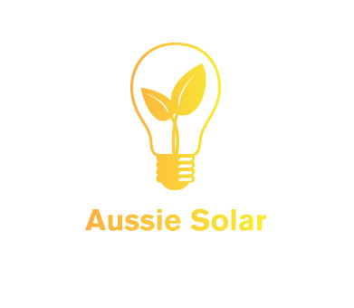

# Project-2 - Solar Power in Australia: The current state of the nation 
Project Group 2 



## Table of Contents

- [Table of Contents](#table-of-contents)
- [Project Intro](#Project-Intro)
- [Structure](#Project-Structure)
- [Setup](#Setup)
- [Instructions](#instructions)
- [Datasets](#Datasets)
- [Analysis](#Analysis)

## Project Intro
Solar photovoltaic (‘solar power’) generated 3.1 per cent of Australia’s electricity in 2016-17, the majority of which came from small-scale rooftop installation. More than two million, or 21 percent, of Australian households now have rooftop solar, with a combined capacity exceeding 10 GW. However, there remains huge potential on Australia’s remaining roofs, for the expansion of solar power, especially given our climate.

Federal solar incentives and rebates for solar installation have led to a rapid adoption of this technology in recent years. However,the factors that that lead to consumers adopting this technology, and how that might inform future measures to increase solar,remain less clear.

### Aim
Create a SQLite database of current and historical data, broken down by postcode, containing solar power installations, power generation, and factors that may influence the uptake of solar (e.g. household income, federal government solar rebates).
Use this database to create a series of interactive data visualisations that describe the current state of home solar in Australia, as well as identifying areas of unmet potential and factors that may influence homeowner’s willingness to adopt this technology.

### Rationale
Potential applications of this project could include:

At a government level, allow the analysis of the rebate schemes success, and direct future initiatives and renewable energy policy.
At the individual household level, allow consumers to see how their suburb compares to the nation and how solar has changed over time. Such information could promote further adoption of solar and could be used as a marketing tool.

## Structure
```

Project-2
|  
|__ SQL
|    |__ SGU.sqlite                      
|
|__ static/                              
|   |__css/                             # Directory for css stylesheets
|   |  |__ d3Style.css                             
|   |  |__ mapStyles.css
|   |  |__ style.css
|   |
|   |__data/                            # Directory for the data files
|   |  |__ SGU/                         # Directory for hitorical SGU data
|   |  |__ ...                          # csv and json files used as source
|   |
|   |__ js/                             # Directory for js files for webpages
|       |__ ...                         # List of js files
|
|__ templates                           # Directory for flask webpages
|   |__ about.html
|   |__index.html
|   |__map.html
|   |__national.html
|
|__ app.py                              # flask app to run the website
|__ data-forgraph.ipynb                 # part of ETL - data cleaning
|__ ETL.ipynb                           # ETL - data cleaning
|__ Group 2 Solar Presentation          # Presentation of the project
|__ initdb.py                           # Heroku file
|__ Procfile                            # Heroku file
|__ README.md                           # read me file
|__ requirements.txt                    # Project requirements file
|__ run.sh                              # Heroku file
|__ runtime.txt                         # Heroku file
|__ Solar Power - Project Proposal.docx # Project proposal

```

## Setup

Link to live interactive dashboard Website : [Solar Power in Australia](http://pg2-solar.herokuapp.com/)

## Datasets
| # | Source | Link |
|-|-|-|
| 1 | Australian Clean Energy Regulator – 2001-2021 Small Scale Solar Installations Australia | [Installations and Outputs](http://www.cleanenergyregulator.gov.au/RET/Forms-and-resources/Postcode-data-for-small-scale-installations#Historical-data) |
| 2 | Australian Bureau of Statistics. Taxation statistics dataset | [Wage data](https://data.gov.au/data/dataset/taxation-statistics-postcode-data/resource/b713d037-d9f5-49e5-a492-502cd7b3a15a) |
| 3 | Australian Clean Energy Regulator – Postcode rebate zone ratings | [Rebate Data](http://www.cleanenergyregulator.gov.au/DocumentAssets/Pages/Postcode-zone-ratings-and-postcode-zones-for-solar-panel-systems.aspx) |
| 4 | Australia – mean income by state | [Weekly income](https://www.statista.com/) |
| 5 | GeoJSON for Australian Suburbs | [GeoJSON Australian Suburbs](https://github.com/tonywr71/GeoJson-Data/blob/master/australian-suburbs.geojson)|
| 6 | Australian Database of Postcode and Suburb data | [Postcode and Suburb](https://www.matthewproctor.com/australian_postcodes) |


## Contributors
- [Dale Currigan](https://github.com/dcurrigan)
- [Helen Amin](https://github.com/helenamin)
- [Rajesh Nair](https://github.com/rajeshnair1984).
- [Ray Camo](https://github.com/rfcamo)